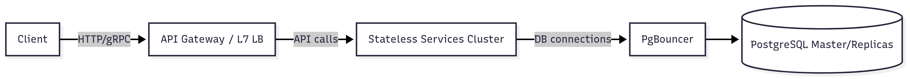

# Гайд по System Design

# Ссылки

- [Моя группа в Telegram](https://t.me/software_noise)
- [Мой YouTube канал](https://www.youtube.com/@PavelVil)

---

# Оглавление

- [Введение](#1-введение)
- [Подход к решению задачи](#2-подход-к-решению-задачи)
    - [Сбор требований](#21-сбор-требований)
    - [Расчеты](#22-расчёты)
        - [Нагрузка: запросы / RPS](#221-нагрузка-запросы-и-rps)
        - [Хранилище: фото, БД и индексы](#222-хранилище-фото-бд-и-индексы)
        - [Пользовательский трафик](#223-пользовательский-трафик)
        - [Инфраструктура](#224-инфраструктура)
        - [OPEX (примерные расходы/мес)](#225-opex-примерные-расходымес)
    - [Верхнеуровневый дизайн](#23-верхнеуровневый-дизайн)
    - [Более детальный дизайн](#24-более-детальный-дизайн)
    - [Масштабирование и компромисы](#25-масштабирование-и-компромисы)
    - [Узкие места и улучшения](#26-узкие-места-и-улучшения)
- [Основные концепции](#3-основные-концепции)
- [Популярные задачи для практики](#4-популярные-задачи-для-практики)
- [Полезные ресурсы](#5-полезные-ресурсы)
- [Шпаргалка: Примеры вопросов на сбор функциональных и не функциональных требований](#шпаргалка-примеры-вопросов-на-сбор-функциональных-и-не-функциональных-требований)
- [Шпаргалка: Формулы расчета](#шпаргалка-формулы-расчета)
- [Шпаргалка: Пример распределения времени на собеседование для каждого этапа](#шпаргалка-пример-распределения-времени-на-собеседование-для-каждого-этапа)
- [Глосcарий](#глосcарий)

# 1. Введение

#### Что проверяют на этом этапе собеседования

На собеседованиях по System Design от вас могут попросить спроектировать свой YouTube, крупную социальную сеть или отдельный компонент большой системы (например, сервис отзывов). Здесь не ждут углубления в мельчайшие детали - важно видеть общую картину. Вы должны уметь абстрагироваться и проектировать систему как набор взаимосвязанных компонентов, где каждый отвечает за свою задачу.

Собеседование проверяет следующие способности:
- Умение выделять основные компоненты системы.
- Определять границы интерфейсов (где заканчивается ответственность одного сервиса и начинается другого).
- Абстрагироваться и декомпозировать задачи.

Как и в реальных проектах, на собеседовании нет идеальных решений. Нужно уметь находить **компромиссы**. Например, если вы выбираете реляционную базу данных - какие у этого плюсы и минусы? Когда будет оправдано использование NoSQL?

Типовые компромиссы, которые придётся обсудить:
- **Производительность vs масштабируемость.** Быстрый, но трудномасштабируемый монолит, или распределённые микросервисы, которые проще масштабировать, но сложнее по производительности?
- **Латентность vs пропускная способность.** Для каких задач важнее минимальная задержка (онлайн-игры, видеозвонки, Google Docs), а где важна пропускная способность (стриминг, загрузка файлов)? В ряде случаев нужен баланс - например, видеозвонки в высоком качестве или облачные игровые сервисы.
- **Доступность vs согласованность данных.** Что важнее для пользователей: всегда доступный сервис, но с риском временной неактуальности данных, или строгая консистентность, но с возможной недоступностью в пиковые моменты? Эту тему описывает **CAP-теорема**.
- **Стоимость разработки vs надёжность/производительность.** Стартапу важна скорость и дешевизна разработки (MVP), а банку - надёжность и безопасность, даже если это дорого. Выбор технологий, оптимизация и железо напрямую влияют на баланс этих факторов.

На собеседовании особенно ценится, если вы умеете:
- обосновывать выбор технологий,
- показывать слабые места своего дизайна,
- предлагать альтернативы.

Кроме компромиссов, важна **грамотная работа с инструментами**. Нужно понимать, когда использовать SQL или NoSQL, RabbitMQ или Kafka, Redis или Memcached. Интервьюер может проверить глубину ваших знаний, задав вопросы о репликации в Kafka, WAL в PostgreSQL и другие подобные вопросы.

Разрабатываемая система должна выдерживать нагрузку в **тысячи и миллионы пользователей**. Это значит, что вам нужно разбираться:
- в стратегиях масштабирования (горизонтальное, вертикальное, шардирование, репликация),
- в кэшировании и его инвалидации,
- в очередях и асинхронности,
- в поиске узких мест и способах их устранения,
- в архитектурных паттернах (Stateless, Service Discovery, API Gateway и др.).

Примерный план прохождения собеседования:
1. Уточнение требований.
2. Примерные расчёты (нагрузка и стоимость).
3. Набросок высокоуровневого дизайна.
4. Углубление в ключевые компоненты.
5. Обсуждение компромиссов.
6. Предложения по масштабированию.

Теперь пройдёмся более подробно по этапам.

# 2. Подход к решению задачи

## 2.1 Сбор требований

На этом этапе главная цель - собрать **функциональные** и **нефункциональные** требования к системе.

- **Функциональные требования** - _что система делает_.
- **Нефункциональные требования** - _как система это делает_.

---
### Функциональные требования

Здесь нам нужно понять: **а что, собственно, система должна уметь делать?**

Например, если мы проектируем условный Twitter, то базовое требование - возможность постить твиты. Но такой уровень детализации слишком общий. Важно уточнять детали:
- Нужно ли пользователю проходить аутентификацию перед написанием поста?
- Сколько символов допускается в одном посте?
- Поддерживаются ли медиафайлы?
- Как быстро сообщение должно появляться у пользователя после публикации?
- Должно ли оно также отображаться в других местах системы (например, в ленте новостей), и с какой задержкой?

Такие уточнения помогают выявить дополнительные компоненты системы, о которых изначально могли не упомянуть.

Как только вы собрали достаточное количество деталей, следующий шаг - **приоритизация**. Нужно понять, что важно для MVP, а что можно реализовать позже. Это поможет избежать траты времени на второстепенные задачи.

Также полезно узнать о **ролевой модели системы**. Например:
- обычный пользователь,
- модератор,
- администратор.

Разный функционал для разных ролей может сильно влиять на архитектурные решения.

---
### Нефункциональные требования

После функциональных требований нужно перейти к нефункциональным. Это уже не про то, _что делает система_, а про то, _как она должна это делать_.

Важные вопросы, которые стоит задать:
- **Задержка и производительность.** Какие задержки приемлемы для операций?
- **Доступность.** Сколько "девяток" ожидается (например, 99.99% = 52 минуты простоя в год)?
- **Согласованность.** Насколько строгой должна быть консистентность? Можно ли пожертвовать ею ради доступности и скорости?
- **Надёжность хранения.** Какие данные нельзя терять ни при каких условиях (например, видео), а какие могут быть пересчитаны при сбоях (например, лайки)?
- **Безопасность.** Нужно ли шифровать данные? Как должна работать аутентификация и авторизация?
- **Нагрузка.** Сколько операций в секунду (RPS/QPS для чтения, WPS для записи) должна выдерживать система?
- **Стоимость.** Архитектура напрямую влияет на цену. Нужно понимать, какие компромиссы возможны.

Кроме этого, обсудите масштаб системы:
- **DAU (daily active users).** Сколько уникальных пользователей в день?
- **Пиковая нагрузка.** Во сколько раз она превышает среднюю?
- **Соотношение чтения и записи.** Может сильно повлиять на выбор базы данных.
- **Объём данных.** Сколько данных генерируется в день, сколько всего нужно хранить (1, 3, 6, 10 лет)?
- **Горячие и холодные данные.** Что будет активно использоваться, а что нужно хранить для истории.

Ещё один блок вопросов касается **глобальности системы**:
- Нужен ли CDN?
- Нужна ли геораспределённая база данных?
- Как будут поддерживаться пользователи из разных регионов?

И наконец, полезно уточнить **планы на будущее**. Фичи, которые появятся через год или два, можно заложить в архитектуру уже на старте.

### 2.2 Расчёты

На предыдущем шаге мы собрали вводные данные. Теперь можно перейти к расчётам, чтобы понять, какая нагрузка будет на систему и каких ресурсов она потребует. Это поможет:
- выделить узкие места ещё на этапе проектирования,
- понять, на что система больше ориентирована - на чтение или запись,
- прикинуть инфраструктуру и стоимость.

Финансовые расчёты будем вести в **USD**, так как это наиболее наглядная и распространённая единица.

#### Вводные данные (сценарий: доска объявлений - клон Avito/eBay)

- DAU = **10 000 000**
- Новых объявлений в день = **2 / пользователь** -> **20 000 000 объявлений/день**
- Просмотров объявлений в день = **10 / пользователь** -> **100 000 000 просмотров/день**
- Фото на объявление = **3**, размер фото = **0.5 MB**
- Ограничение текста в объявлении = **10 000 символов**
- Поиск/фильтры = **5 запросов / пользователь / день** -> **50 000 000 запросов/день**
- Навигация по результатам = **+25% от поисковых запросов** -> **12 500 000 запросов/день**
- Хранение объявлений и фото: **3 года** (~1095 дней)

На основе этих данных считаем: нагрузку (RPS), объём хранилища, трафик, инфраструктуру и стоимость.

---
#### 2.2.1 Нагрузка (запросы и RPS)
**Переменные:**
- Секунд в сутках = 86 400
- Записи в день = 20 000 000
- Чтения в день = 100 000 000
- Поиск = 50 000 000
- Навигация = 12 500 000

**Общий объём запросов в день:**  
20M + 100M + 50M + 12.5M = **182.5M запросов/день**

**Средний RPS:**  
182.5M / 86 400 = **2 113 RPS**

**Пиковая нагрузка:**
- x2 -> **~4 226 RPS**
- x3 -> **~6 340 RPS**

Итого: **средний RPS = 2.1 тысяч, пиковый RPS = 4.2-6.3 тысяч**.

---
#### 2.2.2 Хранилище: фото, БД и индексы

**Фото:**
- В день: 20M объявлений * 3 фото = **60M изображений**
- Объём: 60M * 0.5 MB = **30 TB/день**
- За 3 года: 30 TB * 1095 = **32.85 PB**

**Объявления (текст + мета):**
- Описание = 10 000 байт = 10 KB
- Мета + индексы = 280 байт
- Итого = **10.3 KB/объявление**
- За 3 года: 21.9B * 10.3 KB = **230 TB**
- С учётом накладных расходов (+50%) -> **~340 TB**

**Поисковые индексы:**
- Допустим, 2 KB на запись
- 21.9B * 2 KB = **43.8 TB**

**Метаданные фото:**
- 21.9B объявлений * 3 фото = **65.7B изображений**
- 200 байт/фото -> **~13.1 TB**

По этим расчетам можно сделать вывод: фото - ключевой драйвер хранилища (**десятки петабайт**).

---
#### 2.2.3 Пользовательский трафик

**Изображения:**
- В среднем пользователи смотрят 2 фото на просмотр -> 100M просмотров * 2 = **200M фото/день**
- Объём: 200M * 0.5 MB = **100 TB/день**
- В месяц: 100 TB * 30 = **3 PB/мес**

**JSON/HTML ответы:**
- Общее кол-во запросов: 182.5M
- Средний ответ: 100 KB (0.1 MB)
- Объём: 182.5M * 0.1 MB = **18.25 TB/день**
- В месяц: **547.5 TB/мес**

**CDN кэширование:**
- Фото: 85% с CDN, 15% с origin -> **450 TB/мес** из origin
- JSON/HTML: 20% кэш, 80% origin -> **438 TB/мес**

---
#### 2.2.4 Инфраструктура

- **Приложение:** 20-50 серверов (200-300 RPS/сервер)
- **БД:** PostgreSQL (с шардированием) или NoSQL (Cassandra) -> ~340 TB
- **Поиск:** Elasticsearch/OpenSearch -> ~44 TB индексов (кластер на 10-15 нод)
- **Фото:** объектное хранилище (S3/MinIO) -> ~32.85 PB
- **Кэш:** Redis/Memcached
- **CDN:** для фото и части JSON

---
#### 2.2.5 OPEX (примерные расходы/мес)

- Объектное хранилище: 32.85 PB × $20/TB = **$657,000**
- БД: 340 TB * $100/TB = **$34,000**
- Поиск: 44 TB * $150/TB = **$6,600**
- Трафик (origin): 888 TB * $50/TB = **$44,400**
- CDN: 2.7 PB * $20/TB = **$54,000**
- Серверы (50 * $200): **$10,000**

**Итого: ~$806тыс./мес (~$9.7M/год)**

Дополнительно:
- Бэкапы и холодное хранилище (архив старых объявлений)
- Возможность оптимизации за счёт компрессии фото и JSON

### 2.3 Верхнеуровневый дизайн

Мы собрали требования и сделали расчёты. Теперь пора обозначить верхнеуровневую архитектуру. На этом этапе нужно:
- Показать базовую диаграмму компонентов.
- Описать взаимодействие между ними.
- Выделить инфраструктурные и внешние сервисы.

В качестве примера возьмём сервис объявлений (аналог Avito/eBay), с учётом расширенных требований:
- DAU = 10 млн.
- Новых объявлений в день = 20 млн.
- Просмотров в день = 100 млн.
- Фото на объявление = 3 (по 0.5 MB каждое).
- Максимальная длина текста = 10 000 символов.
- Поисковых запросов в день = 50 млн.
- Навигационных запросов = 12.5 млн.
- Хранение объявлений = 3 года (~1095 дней).
- Интеграция с внешним ML-сервисом модерации.
- Интеграция с внешним аналитическим сервисом.
- Целевые SLA:
    - Открытие объявления <= 200 мс.
    - Поиск/фильтрация <= 300 мс.
    - Создание объявления <= 1 с.

---
#### Основные компоненты системы
1. **Клиенты (web/mobile)** -> обращаются к API.
2. **API Gateway / Load Balancer** -> маршрутизация и балансировка запросов.
3. **Сервисный слой:**
    - **Ad Service** - CRUD для объявлений, статус модерации.
    - **Search Service** - обработка поисковых запросов (Elasticsearch/OpenSearch).
    - **User Service** - аутентификация и профили.
    - **Media Service** - загрузка фото (S3/MinIO).
    - **Analytics Integration Service** - отправка событий во внешний сервис аналитики.
    - **Moderation Proxy Service** - проксирование вызовов в ML-модерацию (с поддержкой ретраев).
4. **Инфраструктура:**
    - **Реляционная БД** (шардированная, реплики) - хранение объявлений.
    - **Объектное хранилище + CDN** - хранение и раздача фото.
    - **Elasticsearch/OpenSearch** - индексация и поиск.
    - **Кэш (Redis/Cluster)** - быстрые ответы для карточек объявлений, подсказок и часто используемых данных.
    - **Брокер сообщений (Kafka/Pulsar/RabbitMQ)** - асинхронная интеграция (модерация, аналитика, индексация).
5. **Внешние сервисы:**
    - ML-сервис модерации объявлений.
    - Аналитический сервис обработки пользовательских событий.

---
#### Основные сценарии работы

- **Создание объявления:**  
  Client -> API Gateway -> Ad Service -> запись в БД + загрузка фото в Object Storage -> отправка событий в брокер сообщений.
- **Асинхронная обработка событий:**
    - Индексация в Search Service.
    - Отправка в Analytics Service.
    - Модерация через Moderation Service.
- **Модерация:**  
  Объявление получает статус _pending_ до завершения проверки.

---
#### Что стоит зафиксировать на схеме
- Внешние сервисы (модерация, аналитика) обрабатываются через **шину событий** для развязки и ретраев.
- **Moderation Proxy Service** необходим, чтобы не зависеть напрямую от доступности ML-сервиса.
- На данном этапе не указываем: L3–L4 балансировщики, разбиение по дата-центрам, детализация кластеров (БД, кэшей и брокеров).

Теперь можно поговорить про ключевые компоненты, обрисовать схему базу данных, API, а так же дорисовать схемы.

### 2.4 Более детальный дизайн

Теперь можно подробнее рассмотреть ключевые компоненты системы. Самым важным из них является **Ad Service**, который отвечает за работу с объявлениями. Рядом с ним стоит выделить поиск и фильтрацию, так как именно они напрямую влияют на удобство пользователей. Ещё один важный элемент - **Media Service**, управляющий фотографиями. А вот интеграции с аналитикой и модерацией в рамках этой задачи можно упомянуть лишь вскользь: они будут присутствовать, но в этом проекте их роль второстепенна.

Первым шагом стоит наметить схему базы данных. В ней три основных сущности: пользователи, объявления и изображения. Для повышения производительности поиска добавляются индексы:
- по категориям - чтобы быстро фильтровать объявления;
- по user_id - чтобы легко находить объявления конкретного пользователя;
- по advertisement_id - для ускоренного доступа к самим объявлениям.

Следующий шаг - описание API Ad Service. Эндпоинтов может быть много, но для собеседования достаточно остановиться на основных.

**Объявления**
- `POST /advertisement` - создать объявление
- `GET /advertisement/{id}` - получить объявление
- `GET /advertisement?category=...&q=...&page=...` - поиск и фильтр
- `PUT /advertisement/{id}` - обновить объявление
- `DELETE /advertisement/{id}` - удалить объявление

**Картинки**
- `POST /advertisement/{id}/images` - получить `upload_url` для загрузки фото
- `GET /advertisement/{id}/images` - список фото

**Служебные**
- `GET /health` - проверка состояния
- `GET /stats` - базовые метрики приложения

API дополняется событиями, которые сервис генерирует:
- `advertisement.created`
- `advertisement.updated`
- `image.uploaded`
- `advertisement.viewed`

Дальше можно углубиться в Ad Service. В базовом варианте он объединяет в себе и CRUD-операции, и API поиска с фильтрами. Такой подход удобен на старте: схема единая, сервис проще поддерживать. Но это же делает его более тяжёлым - сбои поиска или Elasticsearch могут повлиять на весь сервис. Поэтому в перспективе стоит рассматривать вынос поиска в отдельный Search Service с собственным API (`/search`, `/filter`, `/autocomplete`). Это позволит масштабировать поиск независимо, оптимизировать его и даже менять движки. Правда, цена такого подхода - дополнительная сложность и eventual consistency.

Чтобы наглядно показать работу Ad Service, полезно рассмотреть несколько сценариев.

**Создание объявления**
1. Клиент отправляет `POST /advertisement`.
2. Ad Service:
    - валидирует данные,
    - сохраняет объявление в PostgreSQL со статусом `pending`,
    - запрашивает у Media Service временные ссылки на загрузку картинок,
    - генерирует событие `advertisement.created`,
    - ставит задачу на индексирование в Elasticsearch.
3. В ответ клиент получает ID объявления, статус и ссылки для загрузки фото.

**Чтение объявления**
- `GET /advertisement/{id}` -> Ad Service достаёт данные из PostgreSQL и возвращает результат.

**Поиск и фильтры**
- `GET /advertisement?query=phone&category=electronics&price<1000`
- простые фильтры выполняются SQL-запросами по индексам (category, price, region),
- текстовый поиск по названию и описанию уходит в Elasticsearch.

**Обновление и удаление**
- `PUT /advertisement/{id}` обновляет данные в PostgreSQL,
- `DELETE /advertisement/{id}` ставит статус `deleted`,
- оба действия сопровождаются событиями (`updated` или `deleted`) и обновлением индексов.

Здесь можно использовать sequence-диаграммы. Например, цепочку действий при создании объявления или загрузке фото.

Плавно переходим к Media Service: его роль - управление фото. Сценарий выглядит так: клиент создаёт объявление без картинок, Ad Service сохраняет его в БД и запрашивает у Media Service N временных ссылок. Эти ссылки возвращаются клиенту, и уже клиент напрямую загружает изображения в Object Storage. После успешной загрузки Object Storage уведомляет Media Service, который публикует событие `media.uploaded`. Дополнительно может существовать воркер для обработки изображений (метаданные, ресайз, превью). На следующем шаге Ad Service связывает объявления с обработанными фото.

Есть несколько важных деталей: временные ссылки должны быть недолгоживущими (обычно до часа), неудачные загрузки можно фиксировать через DLQ и перезапускать. Дубликаты изображений отсеиваются с помощью бинарной (хэш) или перцептивной (pHash + расстояние Хэмминга) дедупликации. Media Service при этом сохраняет хэш и повторно использует уже загруженные изображения, что экономит хранилище и облегчает модерацию.

Наконец, стоит упомянуть нефункциональные аспекты. Сервисы должны собирать метрики (например, число загрузок фото в секунду или количество объявлений в день), писать логи и поддерживать распределённый трейсинг. Для повышения надёжности используется retry с экспоненциальной задержкой, DLQ для критичных событий, а также механизмы идемпотентности в Media Service, чтобы избежать повторной обработки. Дополнительно стоит предусмотреть ограничение частоты запросов для защиты от DDoS и перегрузки.

Такой набор деталей позволяет перейти к обсуждению масштабирования и компромиссов в архитектуре.

### 2.5 Масштабирование и компромисы

Когда система начинает расти, основная стратегия - горизонтальное масштабирование. Сервисы проектируются как stateless и масштабируются за балансировщиками. Stateful-компоненты (БД, брокер сообщений, Elasticsearch) масштабируются через репликации и шардирование.

Для балансировки запросов используются разные подходы. Внешние клиенты, работающие с API, направляются через балансировщик L7 уровня (например, Nginx или Envoy). А для взаимодействия приложений с базой данных уместно использовать PgBouncer, чтобы управлять пулом соединений и равномерно распределять нагрузку.

Далее стоит поговорить про партиционирование и шардирование. За три года в базе накопится порядка 21,9 миллиардов записей, поэтому партиционирование становится необходимым. Возможны несколько стратегий: по дате создания (например, месячные партиции) или по регионам, выделяя отдельный `region_id`. Для Elasticsearch данные можно шардировать по географии или категориям, чтобы ускорять выборку. В Kafka логично выбирать ключ партиции - либо ID объявления, либо ID региона, чтобы события одного объявления всегда шли в одну партицию.

Репликация применяется ко всем stateful-компонентам. В реляционной БД используется схема мастер + реплики: все записи идут в мастер, а чтение выполняется с реплик. В Kafka устанавливается replication factor = 3, причём именно нечётное число помогает снизить риски и повысить доступность. В Elasticsearch также используется главная нода и реплики: даже при сбое данные можно продолжать читать с реплик.

Если затронуть вопрос консистентности и доступности, то тут видны разные компромиссы. PostgreSQL гарантирует строгую консистентность: запись возможна только при доступности мастера. Это вариант CP по CAP-теореме. Elasticsearch, напротив, работает с eventual consistency - новые объявления видны в течение ~5 секунд, и это уже AP. Kafka также согласована в конечном счёте: потеря части брокеров не приводит к полному падению кластера. CDN ещё один пример AP-подхода: изображения всегда раздаются быстро, но иногда могут быть устаревшими. Это осознанный компромисс ради скорости.

Для пользователей важно хранить данные ближе к региону, чтобы сократить задержки. Для базы данных стоит предусмотреть автоматическое переключение при падении мастера. Такие задачи решаются через инструменты управления кластерами, например Patroni.

Завершая разговор о масштабировании, полезно затронуть потенциальные узкие места. На критических участках стоит задуматься о дополнительных оптимизациях: кэширование для снижения нагрузки на БД, оптимизация шардирования для Elasticsearch, балансировка нагрузки между регионами и защита Kafka от перегрузки за счёт достаточного количества партиций и дискового пространства. Всё это позволяет системе устойчиво выдерживать рост.

### 2.6 Узкие места и улучшения

На этом этапе нужно показать слабые места в системе, объяснить, почему они являются слабыми, и предложить варианты улучшений.

**База данных (БД)**  
Первое, что стоит обсудить, исходя из масштаба нашей системы, - это БД.
- **Проблема вставки данных:** с ростом объема данных вставка замедляется из-за индексов, так как обновление индексов требует дополнительных ресурсов.
- **Как можно решить:**
    - Партиционирование данных.
    - Архивирование старых данных в холодное хранилище.
    - Использование CQRS: операции записи взаимодействуют с основной БД, а операции чтения - с оптимизированным хранилищем для чтения.

**Elasticsearch**  
При большой нагрузке поиск может сильно нагружать отдельные ноды, особенно если запросы идут по одной категории или региону.
- **Как можно решить:** кэшировать популярные запросы в Redis, чтобы снизить нагрузку на Elasticsearch.

**Media Service**  
Media Service может стать узким местом из-за большого объема трафика.
- Используем **Image Processor** для генерации миниатюр изображений.
- Кэшируем контент в **CDN** с высоким TTL.
- Применяем алгоритмы **дедупликации**, чтобы снизить трафик между сервисами и нагрузку на хранилище.

**Балансировщики нагрузки**  
При высоком объеме трафика балансировщики могут стать узким местом:
- Клиент устанавливает HTTPS-соединение с балансировщиком.
- Балансировщик расшифровывает трафик.
- Балансировщик передает незашифрованный трафик на внутренние сервисы.

Для повышения производительности можно рассмотреть следующие варианты:
- Рассматриваем аппаратные балансировщики, где TLS termination почти бесплатен.
- Программные балансировщики (Nginx/Envoy) можно запускать на инстансах с аппаратным ускорением AES-NI.

**Rate Limiter**  
Для защиты от DDoS необходимо использовать многоуровневые лимиты:
- **CDN:** грубые лимиты по IP (например, 1000 запросов/с).
- **API Gateway:** умные лимиты по пользователю (user_id или API-ключ).
- **Сервисный уровень:** локальные лимиты на уровне кластера.

Для работы между множеством инстансов можно использовать Redis. При этом Redis также должен быть кластеризованным и расположенным близко к инстансам.

**Консистентность данных**  
Например, пользователь создал объявление, но не видит его в поиске (Elasticsearch может задерживать обновления).
- **Как можно решить:**
    - Уведомлять пользователя, что объявление появится через несколько минут.
    - Рассмотреть сложные решения с кэшированием и асинхронной синхронизацией.

**Миграции и переиндексация**  
С изменением схем БД и индексов Elasticsearch важно, чтобы пользователи не испытывали даунтаймов.
- **Expand and Contract:**
    - Приложение пишет одновременно в старые и новые поля/таблицы.
    - Фоновый процесс переносит данные в новый формат.
    - После завершения миграции новая версия приложения работает с новой схемой.
- **Elasticsearch:** переиндексацию лучше делать на параллельном кластере, затем переключать приложение на новый индекс.

**Стратегии деплоя**  
Чтобы минимизировать простой сервиса:
- Канареечные релизы для критичных сервисов.
- Теневой трафик для тестирования новой версии под реальной нагрузкой.
- Blue-Green deployment для нулевого даунтайма и мгновенного отката.

В конце стоит обсудить продуктовые KPI, резюмировать выбранные подходы и показать, где можно расширить систему.

# 3 Основные концепции
На System Design интервью потребуется знание основных аспектов, необходимых для проектирования системы, которая удовлетворит собеседующего. Здесь будут указаны ключевые концепции без глубокого объяснения, которые помогут вам успешно пройти это интервью.

## 3.1 Архитектурные паттерны
- **Монолит** - всё в одном приложении и БД. Легко начать, сложно масштабировать.
- **Микросервисы** - много независимых сервисов (каждый со своей логикой и БД). Легко масштабировать отдельно, но сложнее инфраструктура.
- **Event-driven (событийная архитектура)** - сервисы обмениваются событиями через шину (Kafka, RabbitMQ). Подходит для асинхронных процессов.
- **Pub/Sub** - шаблон для обмена событиями: продюсер публикует, консюмер получают.
- **API Gateway** - точка входа для клиентов: роутинг, авторизация, rate limiting.

## 3.2 Масштабирование
- **Вертикальное** - увеличение мощности одной машины (дорого, есть предел).
- **Горизонтальное** - добавление новых нод (требует распределённой логики).
- **Load Balancer** - распределяет запросы (L4/L7). Позволяет масштабировать горизонтально.
- **CDN (Content Delivery Network)** - кэширует статический контент ближе к пользователям, снижает нагрузку на origin.

## 3.3 Данные и хранение
- **SQL** - строгая схема, ACID, подходит для транзакций (Postgres, MySQL).
- **NoSQL** - гибкость, масштабирование: key-value (Redis), document (MongoDB), wide-column (Cassandra).
- **CAP-теорема**: в распределённой системе можно выбрать только 2 из 3:
    - Consistency (согласованность)
    - Availability (доступность)
    - Partition tolerance (устойчивость к сетевым сбоям)
- **Модели консистентности**: strong, eventual, causal, read-your-writes.

## 3.4 Кэширование
- **Уровни**:
    - Client-side (браузер)
    - CDN
    - Reverse proxy (Nginx)
    - Application cache (Redis/Memcached)
    - In-process cache (Guava, Caffeine)
- **Стратегии инвалидации**: TTL, write-through, write-back, write-around.

## 3.5 Очереди и асинхронность
- Брокеры сообшений:
    - Kafka (лог событий, высокая пропускная способность)
    - RabbitMQ (очереди с ack, маршрутизация)
    - SQS/PubSub (managed сервисы в облаке)
- **Гарантии доставки**:
    - At-most-once (можно потерять)
    - At-least-once (можно продублировать)
    - Exactly-once (дорого и сложно, чаще имитируют через идемпотентность).

## 3.6 Базы данных
- **Репликация** - мастер -> реплики для разгрузки чтений.
- **Шардинг** - деление данных по ключу (user_id, region_id).
- **Partitioning** - деление таблицы на части (time-based, hash-based).

## 3.7 Надёжность
- **Failover** - переключение на запасной инстанс.
- **Circuit breaker** - "отрубает" неработающий сервис, чтобы не ждать таймаутов.
- **Rate limiting** - ограничение количества запросов на клиента.
- **Retry + backoff** - повторная попытка с задержкой.

## 3.8 Observability
- **Логирование** - структурированные логи (ELK, Loki).
- **Метрики** - Prometheus/Grafana, метрики сервисов (latency, QPS, ошибки).
- **Tracing** - распределённые трассировки (Jaeger, OpenTelemetry).

## 3.9 Паттерны согласованности
- **Leader-follower replication** (как в Postgres).
- **Quorum reads/writes** (как в Cassandra).
- **Two-phase commit (2PC), Saga** - для распределённых транзакций.

## 3.10 Моделирование данных
- Денормализация (ускорение чтений ценой дублирования).
- CQRS (разделение write/read моделей).
- Event sourcing (хранение событий, не состояний).

## 3.11 Хранилище с несколькими уровнями
- Горячее хранилище (SSD) vs Холодное хранилище (HDD, Glacier).
- Архивирование старых данных - часто ключевой для больших систем

## 3.12 Сеть
- L4 vs L7 load balancing.
- gRPC vs REST vs GraphQL.
- WebSockets / SSE для real-time.

## 3.13 Безопасность
- AuthN (Authentication) vs AuthZ (Authorization).
- OAuth2, OpenID Connect, JWT.
- TLS termination.

## 3.14 Паттерны надёжности
- Идемпотентность (важно для повторов в очередях).
- Bulkhead (изоляция ресурсов).
- Graceful degradation (частичная работа при сбое).

Все досконально учить, естественно, не надо. На интервью важно показать широту знаний и умение применять их к конкретным кейсам.

# 4 Популярные задачи для практики

| Задача                                                             | Категория               | Основной фокус                                                     | Ключевые темы и компоненты                                                                                                                        |
| ------------------------------------------------------------------ | ----------------------- | ------------------------------------------------------------------ | ------------------------------------------------------------------------------------------------------------------------------------------------- |
| **Спроектировать Twitter / Ленту новостей**                        | Социальные сети         | **Таймлайн (лента новостей)** и гибридная модель доставки контента | `Pull vs Push Model`, `Fan-out`, `Кэширование (Redis)`, `Очереди (Kafka)`, `Шардинг БД`, `Компромисс Latency Read/Write`                          |
| **Спроектировать Instagram**                                       | Медиа и Социальные сети | **Хранение и распространение медиаконтента**                       | `Объектное хранилище (S3)`, `CDN`, `Прокси для изображений`, `Микросервисы (метаданные)`                                                          |
| **Спроектировать мессенджер**                                      | Мессенджеры             | **Real-time коммуникация и управление состоянием соединений**      | `WebSockets`, `Сервис сообщений`, `Сервис присутствия`, `Гарантии доставки`, `Хранение сообщений (SQL/NoSQL)`                                     |
| **Спроектировать сервис нотификаций**                              | Инфраструктура          | **Асинхронная массовая рассылка по разным каналам**                | `Очереди задач (RabbitMQ)`, `Воркеры`, `Rate Limiting`, `Адаптеры (Email, SMS, Push)`                                                             |
| **Спроектировать сервис сокращения ссылок**                        | Инфраструктура          | **Генерация ключей и сверхбыстрый редирект**                       | `Генерация ключей (Hash, Snowflake ID)`, `Кэширование (Redis)`, `Key-Value БД`, `Горизонтальное масштабирование`                                  |
| **Спроектировать Amazon / Netflix**                                | E-Commerce и Стриминг   | **Каталог, рекомендации и доставка контента**                      | `Рекомендательные системы (ML)`, `Поиск (Elasticsearch)`, `Корзина (Redis)`, `CDN`, `Микросервисная архитектура`                                  |
| **Спроектировать сервис заказа такси**                             | Геосервисы              | **Геолокация, matching и real-time обновления**                    | `Сервис геолокации`, `Геопространственные индексы`, `Matching Algorithm`, `WebSockets`, `Очереди диспетчеризации`                                 |
| **Спроектировать поискового робота (Web Crawler)**                 | Обработка данных        | **Распределенный обход и дедупликация**                            | `URL Frontier (очередь с приоритетами)`, `Politeness (задержки)`, `Дедупликация (Bloom filters)`, `Распределенные воркеры`, `Хранилище (HDFS/S3)` |
| **Спроектировать поиск (Google Search)**                           | Поиск                   | **Построение и масштабирование поискового индекса**                | `Инвертированный индекс`, `Ранжирование (PageRank, ML)`, `Шардинг индекса`, `Кэш запросов`                                                        |
| **Спроектировать сервис для поиска и отзывов о местных компаниях** | Геосервисы и Поиск      | **Геопространственный поиск и ранжирование**                       | `Гео-индексы`, `Ранжирование по дистанции и рейтингу`, `Кэширование запросов`                                                                     |

# 5 Полезные ресурсы
- System Design Primer - https://github.com/donnemartin/system-design-primer
- ByteByteGo (сайт и YouTube канал) - https://bytebytego.com/, https://www.youtube.com/channel/UCZgt6AzoyjslHTC9dz0UoTw
- Grokking the System Design Interview - https://www.grokkingsystemdesign.com/
- Книга "Высоконагруженные приложения. Программирование, масштабирование, поддержка" (Клеппман М.)
- Книга "System Design. Подготовка к сложному интервью"

---

## Шпаргалка: Примеры вопросов на сбор функциональных и не функциональных требований
### Функциональные требования

| Вопрос                                                              | Пример уточнения / Ответ                                   |
| ------------------------------------------------------------------- | ---------------------------------------------------------- |
| Что является основным действием пользователя?                       | Постинг твитов, загрузка видео, отправка сообщений         |
| Нужна ли аутентификация перед выполнением действия?                 | Да, пост можно сделать только после входа в аккаунт        |
| Какие ограничения по размеру/объёму данных?                         | Твит - до 280 символов, видео - до 500 МБ                  |
| Поддерживается ли мультимедиа?                                      | Изображения, видео, ссылки                                 |
| Как быстро действие должно быть отражено в интерфейсе пользователя? | Пост появляется в течение 1 секунды.                       |
| Нужно ли синхронное распространение события в другие части системы? | Пост должен попасть в ленту подписчиков                    |
| Есть ли разные роли пользователей?                                  | Пользователь, модератор, администратор                     |
| Какие действия доступны каждой роли?                                | Модератор - блокировка постов, админ - управление системой |
| Какие фичи обязательны в MVP, а что может быть реализовано позже?   | MVP: постинг + лента, позже: рекомендации, хэштеги, лайки  |
### Нефункциональные требования

| Вопрос                                                | Пример уточнения / Ответ                               |
| ----------------------------------------------------- | ------------------------------------------------------ |
| Какое время отклика является допустимым?              | До 200 мс для отображения поста                        |
| Какой SLA по доступности требуется?                   | 99.99% (~52 минуты простоя в год)                      |
| Насколько строгая должна быть консистентность данных? | Лайки можно пересчитать, но посты терять нельзя        |
| Какие данные нельзя терять ни при каких условиях?     | Загруженные видео, профили пользователей               |
| Какие данные могут быть восстановлены/пересчитаны?    | Лайки, просмотры, счётчики                             |
| Какие требования к безопасности?                      | Шифрование, двухфакторная аутентификация               |
| Какие пиковые нагрузки ожидаются?                     | 10x от средней (например, во время трансляции)         |
| Какое соотношение операций чтения и записи?           | 80% чтение / 20% запись                                |
| Сколько уникальных пользователей в день (DAU)?        | 10 млн DAU                                             |
| Сколько данных создаётся ежедневно?                   | 500 ГБ/день (видео, посты, комментарии)                |
| Как долго данные должны храниться?                    | 1 год для логов, 10 лет для пользовательского контента |
| Нужно ли геораспределение и CDN?                      | Да, пользователи из разных регионов                    |
| Какие планы на будущее (фичи, расширение)?            | Добавить рекомендации, поддержку стриминга             |

## Шпаргалка: Формулы расчета
### 1. Нагрузка (RPS)
- Общее число запросов в день = Записи + Чтения + Поиск + Навигация
- Средний RPS = Общее число запросов в день / 86 400
- Пиковый RPS = Средний RPS * коэффициент (обычно 2-3)

### 2. Фото (медиа)
- Фотографий в день = Количество объявлений в день * Количество фото на объявление
- Размер фото в день = Количество фото в день * Размер одного фото
- Размер фото за период = Размер фото в день * Количество дней

### 3. Тексты и метаданные
- Размер объявления = Размер текста + Размер метаданных
- Общий размер объявлений = Общее количество объявлений * Размер объявления
- Итоговый размер объявлений = Общий размер объявлений * 1.5 (с учётом накладных расходов)

### 4. Поисковые индексы
- Размер индексов = Общее количество объявлений * Размер индекса на объявление

### 5. Метаданные фото
- Размер метаданных фото = Общее количество фото * Размер метаданных на фото

### 6. Трафик
- Трафик изображений в день = Количество просмотров * Среднее количество фото на просмотр * Размер фото
- Трафик JSON/HTML в день = Общее количество запросов в день * Средний размер ответа
- Трафик на origin = Общий трафик * (1 - коэффициент кэширования CDN)

### 7. OPEX (стоимость)
- Стоимость хранилища = Объём хранилища (TB) * Цена за TB
- Стоимость трафика = Трафик origin (TB) * Цена за TB
- Стоимость серверов = Количество серверов * Цена за сервер

## Шпаргалка: Пример распределения времени на собеседование для каждого этапа

### 1. Введение (3–5 мин)
- Приветствие, контекст задачи, уточнение требований.

### 2. Подход к решению задачи (50–52 мин)

#### 2.1 Сбор требований (6–8 мин)
- Функционал, пользователей, SLAs, ограничения.
- Цель - показать системное мышление и задавать уточняющие вопросы.

#### 2.2 Расчеты (6–8 мин)
- **2.2.1 Нагрузка:** запросы/RPS.
- **2.2.2 Хранилище:** медиа, БД, поисковые индексы.
- **2.2.3 Пользовательский трафик:** дневной и месячный объем.
- Делаем быстрые оценки, не углубляясь в точные цифры.

#### 2.3 Верхнеуровневый дизайн (6–8 мин)
- Основные компоненты: фронтенд, бэкенд, БД, кэш, очереди.
- Нарисовать простую схему системы.

#### 2.4 Более детальный дизайн (10–12 мин)
- Проработка компонентов: базы данных, очереди, микросервисы, API.
- Детали обработки данных, алгоритмы, взаимодействия.

#### 2.5 Масштабирование и компромисы (6–8 мин)
- Горизонтальное/вертикальное масштабирование.
- Кэширование, шардинг, партиционирование.
- Обсуждение компромисов: latency vs cost, consistency vs availability.

#### 2.6 Узкие места и улучшения (6–8 мин)
- Определение потенциальных узких мест.
- Предложение улучшений: кэширование, очереди, оптимизация запросов.
- Надёжность, стратегии деплоя (Blue-Green, канареечные релизы).

---

## Глосcарий
- **Производительность** - насколько быстро система обрабатывает запросы (например, сколько пользователей она может обслужить за секунду).
- **Масштабируемость** - способность системы расти (поддерживать больше пользователей или данных) без деградации работы.
- **Латентность** - задержка между запросом и ответом, обычно измеряется в миллисекундах.
- **Пропускная способность** - количество запросов или данных, которые система может обработать за единицу времени.
- **Доступность** - процент времени, когда система работает и доступна пользователям (например, SLA 99.9%).
- **Консистентность** - свойство системы, при котором данные остаются одинаковыми во всех частях системы (нет рассинхрона).
- **CAP-теорема** - утверждает, что распределённая система не может одновременно гарантировать **C**onsistency (согласованность), **A**vailability (доступность) и **P**artition tolerance (устойчивость к сетевым сбоям) - можно выбрать только два.
- **NoSQL** - семейство нереляционных баз данных (например, MongoDB, Cassandra), хорошо подходящих для масштабирования и хранения больших объёмов данных.
- **SQL** - язык работы с реляционными базами данных (PostgreSQL, MySQL), где данные хранятся в таблицах со связями.
- **RabbitMQ** - брокер сообщений, поддерживает очереди и гарантированную доставку сообщений.
- **Apache Kafka** - распределённая система логов/очередей для потоковой обработки данных и событий в реальном времени.
- **PostgreSQL** - реляционная СУБД с поддержкой ACID-транзакций, JSON, репликации и расширений.
- **Шардирование в БД** - разделение базы данных на части (шарды), каждая хранится отдельно и обрабатывает часть запросов.
- **Resharding** - процесс перераспределения данных при изменении количества шардов (например, добавили новый сервер, и часть данных нужно "переселить").
- **Партиционирование в БД** - разделение таблиц на части (партиции) внутри одной БД для ускорения запросов и управления большими данными.
- **CDN (Content Delivery Network)** - сеть серверов по всему миру, которые кэшируют и отдают статический контент (фото, видео, скрипты) ближе к пользователю.
- **OPEX (Operational Expenditures)** - операционные расходы на поддержку работы системы (серверы, облако, люди, трафик).
- **Sequence-диаграммы** - диаграммы последовательностей, показывающие порядок взаимодействий между сервисами/компонентами во времени.
- **Канареечные релизы (Canary releases)** - выкатывание новой версии приложения только на часть пользователей для проверки перед масштабным релизом.
- **Shadow Traffic** - отправка реального трафика одновременно в старую и новую систему, но без ответа пользователю (для теста нагрузки и стабильности).
- **Blue-Green Deploy** - стратегия релиза, при которой есть две среды (синяя и зелёная). Пользователи работают в одной, в другую выкатывается новая версия. После проверки трафик переключается.